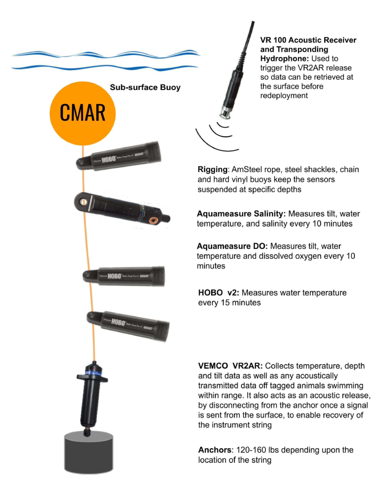

```{r setup, include=FALSE}
knitr::opts_chunk$set(echo = FALSE, dpi = 600)

```

```{r, echo=FALSE, message=FALSE}
library(knitr)
library(lubridate)
library(purrr)
library(sf)
library(ggplot2)
library(ggsflabel)
library(ggspatial)
library(strings)
library(dplyr)
library(viridis)
```

 
```{r}

county <- params$county
#county <- "Yarmouth"
# path to the folder with the data to be included in the report
path <- paste("Y:/Coastal Monitoring Program/Open Data", county, "final/rds", sep = "/")

# read all rds files and rbind together
dat <- list.files(path, full.names = TRUE, pattern = ".rds") %>%
  map_dfr(readRDS)

dat <- dat %>% 
  filter(STATION != "Old Point Channel", STATION != "Tucker Island")

waterbodies <- unique(dat$WATERBODY)
n_waterbodies <- length(waterbodies)

fig.caption <- "Oceanographic variables measured at "
table.caption <- "Deployment details for "

i = 0 # counter for waterbody
k = 1 # counter for figure number
text.size <- 2

```

```{r}
# set up map params

# # path to NS counties shapefile
# path.shp <- file.path("Y:/Projects/Datasets/Merged_NS_Counties")
# 
# # import NS counties shapefile and remove NA row (should have 18 rows - 1 for each county)
# NS_raw <- read_sf(paste(path.shp, "Merged_Counties2.shp", sep = "/")) %>%
#   na.omit()
# 
# # add column with "1" for county of interest and "0" for other counties
# NS <- NS_raw %>%
#   mutate(COL.COUNTY = if_else(County == county, 1, 0)) %>%
#   mutate(COL.COUNTY = ordered(factor(COL.COUNTY), levels = c(1, 0)))
# 
# # extract unique station locations and convert to sf object
# stations <- dat %>%
#   write_report_table(keep.waterbody = TRUE) %>%
#   select(Waterbody, Station, Latitude, Longitude) %>%
#   distinct(Station, .keep_all = TRUE) %>%
#   st_as_sf(coords = c("Longitude", "Latitude"), remove = FALSE,
#            crs = 4326, agr = "constant")

```


# Introduction

The Centre for Marine Applied Research (CMAR) measures environmental parameters throughout Nova Scotia's coastal waters under the Coastal Monitoring Program. This program supports science-based data collection to inform coastal ocean users and was originally implemented by the Nova Scotia Department of Fisheries and Aquaculture in 2012.

This document presents deployment details and summary figures of program data collected for **`r county` County** (Figure `r k` and Figure `r k+1`).

The data are available for download from the Nova Scotia [Open Data Portal](https://data.novascotia.ca/). For more information on CMAR and the Coastal Monitoring Program, visit the [CMAR website](https://cmar.ca/).

This document should be considered as a guide only, as data collection and retrieval are ongoing. The information may be revised pending ongoing data collection and analyses. 

```{r, message=FALSE, error=FALSE, fig.width=8}

# ggplot() +
#   geom_sf(data = NS, col = NA, fill = NA) +
#   annotation_map_tile(type="cartolight", zoomin = 0) +
#   geom_sf(data = NS, col = "black", size = 0.05, aes(fill = COL.COUNTY)) +
#   scale_fill_manual(values = c("#1B9E77", NA)) +
#   fixed_plot_aspect(ratio = 2)+
#   theme(text=element_text(size = 12),
#         axis.title = element_blank()) +
#   theme(legend.position = "none")

```

Figure `r k`: `r county` County (green).

```{r,  message=FALSE, error=FALSE}
k = k+1
```


```{r, message=FALSE, error=FALSE, warning=FALSE, fig.width=8}
# count.map <- NS %>% filter(COL.COUNTY == 1)
# bb_count <- st_bbox(count.map)
# bb_count[3] <- -58
# 
# NS_count <- st_crop(NS, bb_count)
# 
# 
# set.seed(12)
# ggplot() +
#   geom_sf(data = NS_count, fill= NA) +
#   annotation_map_tile(type="cartolight", zoomin = 0) +
#   geom_sf(data = stations) +
#   geom_sf_label_repel(data = stations, aes(label = Station),
#                       label.size = NA,
#                       fill = NA, size = text.size) +
#   annotation_scale(location = "br") +
#   annotation_north_arrow(location = "tl", which_north = "true",
#                           height = unit(1, "cm"),
#                          width = unit(1, "cm")) +
#   fixed_plot_aspect(ratio = 2) +
#   theme(text=element_text(size=12),
#         axis.title = element_blank())

```
<br>

Figure `r k`: Sensor string sampling stations in `r county` County.

```{r}
k = k+1
```


## Data Collection 

CMAR collects temperature, dissolved oxygen, and intermittent salinity data using autonomous sensors attached to moored lines, called ‘sensor strings’. Each string is attached to the seafloor by an anchored acoustic release and suspended by a sub-surface buoy, with sensors attached at various depths (Figure `r k`). Strings are typically deployed for several months, and data are measured every 10 minutes to 1 hour depending on the sensor. This may produce tens- to hundreds- of thousands of observations for a single deployment. Data are retrieved by triggering the acoustic release, which enables the sensor string to float to the surface, where the data are downloaded. The string can be re-deployed at the same location or moved to another area of interest. 

## Data Processing

The data presented here have been quality controlled and some data were excluded from the reported dataset due to known errors and explainable outliers.




Figure `r k`: Example sensor string configuration (not to scale).


# `r county` County Coastal Data

Coastal data is presented by waterbody. For each waterbody, there is a table of deployment details followed by figures showing the data at each station. A red line is included in temperature figures to indicate the -0.7°c freeze threshold for salmonids (for figures where the temperature falls below this threshold).


```{r, fig.width = 8.5, fig.height = 5, results = 'hide',  results ='asis', message=FALSE}
for(i in 1:n_waterbodies){
#for(i in 8){

  waterbody_name <- waterbodies[i]
  waterbody_dat <- dat %>% filter(WATERBODY == waterbody_name)

  stations <- unique(waterbody_dat$STATION)


  cat('\n##', waterbody_name, '\n')

  cat('\n')

  table <- write_report_table(waterbody_dat, keep.waterbody = FALSE)

  print(kable(table, align = "c",
        caption = paste("Table ", i, ": ", table.caption, waterbody_name, ".", sep = "")))


  for(j in 1:length(stations)){

    k = k + 1
    station.j <- stations[j] # station of interest

    cat('\n###', station.j, '\n')

    # subset data to station of interest
    station_dat <- waterbody_dat %>% filter(STATION == station.j)%>%
      convert_depth_to_ordered_factor() 

    # calculate timespan of deployments and adjust x-axis
    timespan <- difftime(max(station_dat$TIMESTAMP), min(station_dat$TIMESTAMP), units = "days")
    timespan <- unclass(timespan)[1]
    axis_breaks <- get_xaxis_breaks(timespan)
    
    # set colour palette
    n.depth <- length(unique(station_dat$DEPTH))
    if(n.depth > 6){
      color.palette <- viridis(n.depth, direction = -1)
    } else{
      color.palette <- rev(viridis(6, option = "D"))
    }

    print(
      plot_variables_at_depth(station_dat,
                             # plot.title = station.j,
                              color.palette = color.palette,
                              vars.to.plot = unique(station_dat$VARIABLE),
                              date.breaks.major = axis_breaks$date.breaks.major,
                              date.breaks.minor = axis_breaks$date.breaks.minor,
                              date.labels.format = axis_breaks$date.labels.format)
    )
    cat(paste("Figure ", k, ": ", fig.caption, station.j, ".",  sep = ""), '\n')

    cat('\n')


  }
}

```

# Document History

```{r}
i = i +1

kable(params$doc.hist, align = "c",
         caption = paste("Table ", i, ": Document history.", sep = ""))

```

